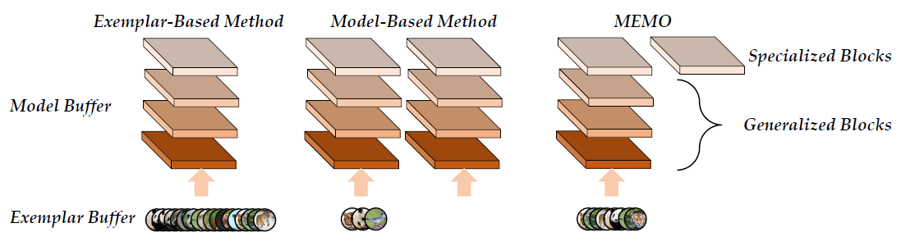

# A Model or 603 Exemplars: Towards Memory-Efficient Class-Incremental Learning

The code repository for "[A Model or 603 Exemplars: Towards Memory-Efficient Class-Incremental Learning](https://arxiv.org/abs/2205.13218)" (**ICLR'23 Spotlight**) in PyTorch. If you use any content of this repo for your work, please cite the following bib entry:

```
@inproceedings{zhou2023model,
  title={A Model or 603 Exemplars: Towards Memory-Efficient Class-Incremental Learning},
  author={Zhou, Da-Wei and Wang, Qi-Wei and Ye, Han-Jia and Zhan, De-Chuan},
  booktitle={ICLR},
  year={2023}
}
```


## MEMO: Memory-Efficient expandable MOdel


Real-world applications require the classification model to adapt to new classes without forgetting old ones. Correspondingly, Class-Incremental Learning (CIL)
aims to train a model with limited memory size to meet this requirement. Typical CIL methods tend to save representative exemplars from former classes to
resist forgetting, while recent works find that storing models from history can substantially boost the performance. However, the stored models are not counted
into the memory budget, which implicitly results in unfair comparisons. We find that when counting the model size into the total budget and comparing methods
with aligned memory size, saving models do not consistently work, especially for the case with limited memory budgets. As a result, we need to holistically
evaluate different CIL methods at different memory scales and simultaneously consider accuracy and memory size for measurement. On the other hand, we dive deeply into the construction of the memory buffer for memory efficiency. By analyzing the effect of different layers in the network, we find that shallow and deep layers have different characteristics in CIL. Motivated by this, we propose a simple yet effective baseline, denoted as MEMO for Memory-efficient Expandable MOdel. MEMO extends specialized layers based on the shared generalized representations, efficiently extracting diverse representations with modest cost and maintaining representative exemplars. Extensive experiments on benchmark datasets validate MEMO’s competitive performance.

<div align="center">
  


</div>


## Prerequisites
- [torch](https://github.com/pytorch/pytorch)
- [torchvision](https://github.com/pytorch/vision)
- [tqdm](https://github.com/tqdm/tqdm)
- [numpy](https://github.com/numpy/numpy)


## Training scripts
- Train CIFAR100
```
python main_memo.py -model memo -init 10 -incre 10 -ms 3312 -net memo_resnet32 -p fair -d 3 --train_base -d 0 1 2 3
```

## Acknowledgment
We thank the following repos providing helpful components/functions in our work.

- [PyCIL: A Python Toolbox for Class-Incremental Learning](https://github.com/G-U-N/PyCIL)
- [Deep Class-Incremental Learning: A Survey](https://github.com/zhoudw-zdw/CIL_Survey)

## Contact
If there are any questions, please feel free to contact with the authors: Da-Wei Zhou (zhoudw@lamda.nju.edu.cn) and Qi-Wei Wang (wangqiwei@lamda.nju.edu.cn). Enjoy the code.

<div align="center">


</div>
